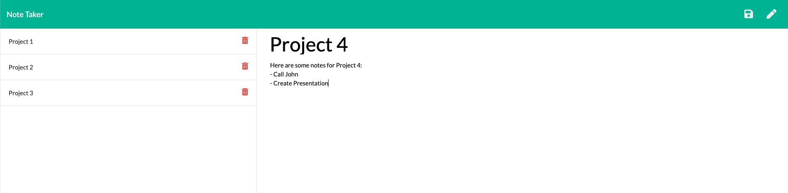
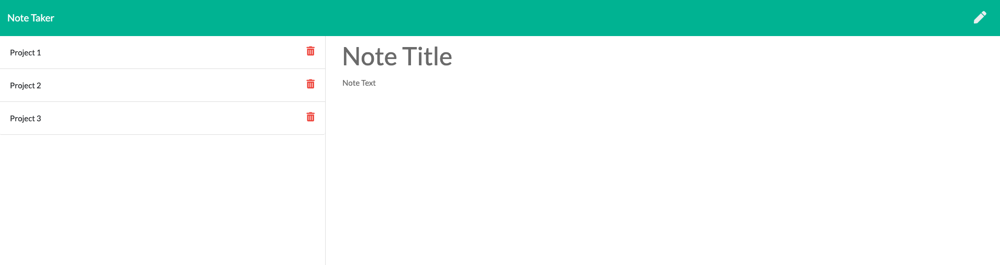

# Note-Taker

 ## Description

  Welcome to Note Taker! This app takes in syntax from the user and saves their notes to a panel for future use. Additionally, the user may delete notes as well. To accomplish this, html, javascript, express.js and node.js were used to create the finished product. Please use the Note Taker to keep yourself organized and never miss a beat! Enjoy!

  

  

  

  ## Table of Contents
  
  - [Installation](#installation)
  - [Testing](#tests)
  - [Usage](#usage)
  - [License](#license)
  - [Contributors](#contributors)
  - [Link to Deployed Application](#link)
  - [Questions](#questions)

  ## Installation

  - Run Command: npm install
  - Start Command: node server.js

  ## Tests
  
  - Run Command: None

  ## Usage

  - This application will run through the command line using node.js. Please see installation instructions and tests for more information.

  ## License

  

  ## Contributors

  - None

  ## Link

  - https://stormy-bayou-40437.herokuapp.com/

  ## Questions? 
  
  - Feel free to contact me at ksmera01@gmail.com